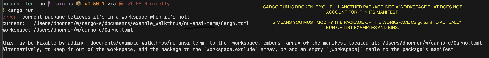

# Auto‑Resolve Workspace Errors in cargo‑e

When using **cargo**, you might encounter a situation where Cargo mistakenly treats your package as if it were part of a workspace.  For instance, if you clone some code into a folder of your workspace.

Instead of reporting available examples and binaries or running your target, Cargo returns an error indicating that the package is misinterpreted as belonging to a workspace—even when it isn’t.

## The Issue

Cargo’s current behavior, rather than gracefully handling packages that aren’t accounted for in the parent workspace, it halts execution with an error. Ideally, Cargo should continue to list examples and binaries and execute them normally—even if the package isn’t explicitly included in the workspace.

## How cargo‑e Works Around the Problem

To overcome this limitation, **cargo‑e** automatically performs the following steps:

- **Temporary Update:** It temporarily adds an empty `[workspace]` section to your package's **Cargo.toml**. This instructs Cargo to treat your package as standalone.
- **Execution:** With the temporary change in place, Cargo executes the command successfully and reports all available targets.
- **Restoration:** After the command completes, the temporary `[workspace]` section is removed, and your **Cargo.toml** is restored to its original state.

## Benefits for You

- **Seamless Operation:** No manual configuration changes are needed.
- **Non‑Invasive:** The temporary change is automatically reversed, leaving your project files intact.
- **Consistent Experience:** Both CLI and TUI modes benefit from the workaround, ensuring smooth operation even in complex workspace setups.

## Fix Details

The fix for this behavior can be found in the [cargo-e-v0.1.17 release](https://github.com/davehorner/cargo-e/releases/tag/cargo-e-v0.1.17).

**Added**  
- Auto-resolve workspace errors: When a Cargo package is mistakenly treated as part of a workspace, commands (like `cargo run`) now automatically detect the error and temporarily patch the manifest (by appending an empty `[workspace]` table) before executing the command. The original manifest is restored afterward. This behavior has been implemented for both CLI and TUI modes.

**Changed**  
- Updated target collection and run routines to use the new manifest patching mechanism, ensuring a smoother user experience without manual intervention.

## Caveats and Considerations

Because this feature works by modifying your package's **Cargo.toml** file on the fly, there are a few potential ramifications:

- **Race Conditions:** If multiple **cargo‑e** processes run concurrently on the same project, they might attempt to modify the **Cargo.toml** file simultaneously. This can lead to race conditions where one process’s changes could conflict with another’s, potentially resulting in unpredictable behavior.
- **File System Timing:** The temporary patch is applied and later reverted. In some cases—especially with slower storage systems—there may be a brief window during which the patched file is visible to other processes. This could cause unexpected behavior if another tool reads the file at that moment.
- **Intended as a Workaround:** This behavior is a temporary workaround for a Cargo limitation. (I hope this changes some day!)  Ideally, Cargo should continue to report examples and run commands even when the parent workspace doesn't account for the package. Users with complex project setups are encouraged to configure their workspaces properly to avoid these issues altogether.

## In Summary

**cargo‑e** takes care of the workspace misinterpretation issue on your behalf—so you can focus on running and exploring your Rust examples without getting bogged down by configuration quirks.

If you have any questions or feedback about this feature, please visit our [GitHub repository](https://github.com/davehorner/cargo-e) or join our community discussions.

